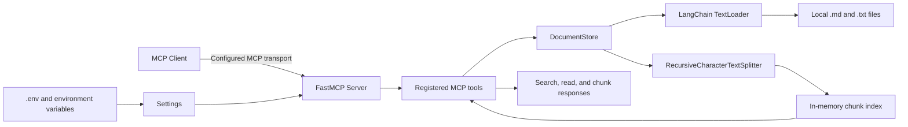

# LangChain Documents MCP Server

Example MCP server that loads local `.md` and `.txt` files with LangChain, splits them into chunks, and exposes search and retrieval tools over MCP. The default local setup uses the `streamable-http` transport at `http://127.0.0.1:9015/mcp`.

## Architecture Overview



This example follows a simple request and indexing pipeline:

- Startup begins in `scripts/run_local.sh`, which validates configuration and launches `python -m langchain_documents_mcp_server.main`.
- `main.py` delegates to `server.py`, where `create_server()` loads typed settings from `.env`, configures logging, creates the `DocumentStore`, and registers the MCP tools.
- `DocumentStore.reload()` scans `DOCUMENTS_PATH`, loads `.md` and `.txt` files with LangChain `TextLoader`, splits them with `RecursiveCharacterTextSplitter`, and builds an in-memory index of document metadata and chunks.
- `search_documents()` performs lightweight keyword scoring against indexed chunks and returns excerpts, while `read_document()` and `get_document_chunk()` return the original file or a single indexed chunk.
- Tool responses are wrapped in a consistent `{ "ok": true, "result": ... }` or `{ "ok": false, "error": ... }` payload so clients receive structured success and failure responses instead of raw tracebacks.

Main implementation modules:

- `config.py`: typed settings, transport normalization, and validation.
- `document_store.py`: file discovery, LangChain loading, chunking, in-memory indexing, and search ranking.
- `server.py`: FastMCP server creation, tool registration, and response/error wrapping.
- `errors.py`: domain-specific error types returned by the tools.
- `logging_config.py`: shared logging setup.
- `scripts/*`: setup, runtime, testing, and license-audit helpers.

## All Resources

High-level resources used to implement this example:

| Resource | Where it appears | Purpose |
| --- | --- | --- |
| MCP SDK / `FastMCP` | `src/langchain_documents_mcp_server/server.py` | Exposes the server as an MCP endpoint and registers the tools. |
| Pydantic + `pydantic-settings` | `src/langchain_documents_mcp_server/config.py`, `.env` | Loads and validates typed runtime configuration. |
| LangChain `TextLoader` | `src/langchain_documents_mcp_server/document_store.py` | Reads local Markdown and text files into LangChain documents. |
| LangChain `RecursiveCharacterTextSplitter` | `src/langchain_documents_mcp_server/document_store.py` | Splits documents into chunks for search and retrieval. |
| In-memory document index | `src/langchain_documents_mcp_server/document_store.py` | Stores chunk metadata and document lookup state without a database. |
| Local source corpus | `sample_documents/` or `DOCUMENTS_PATH` | Provides the documents indexed by the server. |
| Runtime scripts | `scripts/setup.sh`, `scripts/run_local.sh` | Set up the virtual environment and start the example locally. |
| Verification scripts | `scripts/test.sh`, `scripts/test_coverage.sh`, `scripts/check_licenses.py` | Run tests, generate coverage reports, and verify the open-source dependency policy. |
| Tests | `tests/test_*.py` | Covers config validation, document indexing, search behavior, server wiring, and the module entrypoint. |

## Prerequisites

- Python 3.11+
- A client that can connect to the configured MCP transport; the default setup uses Streamable HTTP
- Node.js and npm if you want to run MCP Inspector manually on that machine

## Quick Start

```bash
cd /path/to/chaindocs_MCP_example_langchain_docs
./scripts/setup.sh
./scripts/run_local.sh
```

The first command creates `.venv`, installs Python dependencies, and creates `.env` from `.env.example` if needed.
The helper scripts call `.venv/bin/python` directly and export `PYTHONPATH=$ROOT_DIR/src` so local runs always execute the source tree from this repository.

## Configuration

Edit `.env` if you want to change the transport, endpoint, document directory, or chunking behavior:

- `MCP_TRANSPORT`: defaults to `streamable-http`; the aliases `http_streamable`, `streamable_http`, and `http-streamable` are normalized to the same value
- `MCP_HOST`: bind host for the HTTP server
- `MCP_PORT`: bind port for the HTTP server
- `MCP_STREAMABLE_HTTP_PATH`: Streamable HTTP endpoint path
- `MCP_STATELESS_HTTP`: use stateless HTTP mode
- `MCP_JSON_RESPONSE`: use JSON responses instead of SSE framing
- `DOCUMENTS_PATH`: directory to scan for `.md` and `.txt` files
- `ALLOWED_EXTENSIONS`: comma-separated suffixes
- `CHUNK_SIZE`: LangChain chunk size
- `CHUNK_OVERLAP`: overlap between chunks
- `MAX_RESULTS`: default search limit

Default values point at `sample_documents/`, and the server listens on `http://127.0.0.1:9015/mcp` after setup.

## Run The Server

```bash
./scripts/run_local.sh
```

This starts the MCP server using the transport configured in `.env`. With the default template, it listens on `http://127.0.0.1:9015/mcp`.

You can also run the entrypoint directly:

```bash
PYTHONPATH=src .venv/bin/python -m langchain_documents_mcp_server.main
```

## Manual Testing With MCP Inspector

This repo's manual Inspector flow assumes the default `MCP_TRANSPORT=streamable-http`.

Use two terminals.

Terminal 1 starts the server:

```sh
./scripts/run_local.sh
```

Terminal 2 starts MCP Inspector with the plain command:

```sh
export DANGEROUSLY_OMIT_AUTH=true
npx @modelcontextprotocol/inspector
```

Then configure the MCP Inspector UI manually. Inspector is treated as an external tool here; this repo does not install or pin it for you:

1. Choose the `streamable-http` / Streamable HTTP transport in the Inspector UI.
2. Set the server URL to `http://127.0.0.1:9015/mcp`.
3. Connect to the server.

Verified local Inspector toolchain on `2026-03-31`:

- `node`: `v25.6.1`
- `npm`: `11.9.0`

If Inspector does not connect on another machine, compare the output of `node -v` and `npm -v` with the versions above before debugging the MCP server itself.

Manual smoke-test sequence inside MCP Inspector:

1. Call `server_info` and confirm `result.transport` is `streamable-http`.
2. Call `list_documents` and confirm the sample set contains `architecture.txt` and `getting-started.md`.
3. Call `search_documents` with `{"query":"streamable http","limit":3}` and confirm at least one chunk from `architecture.txt` is returned.
4. Call `read_document` with `{"source":"getting-started.md"}` and confirm the full document content is returned.
5. Copy a `chunk_id` from the search result and call `get_document_chunk` with `{"chunk_id":"<copied-chunk-id>"}`.

## Available MCP Tools

- `server_info()`
- `reload_documents()`
- `list_documents()`
- `search_documents(query, limit=5)`
- `read_document(source)`
- `get_document_chunk(chunk_id)`

## Example Client Command

If your MCP client accepts an HTTP MCP endpoint, point it at the default URL:

```bash
http://127.0.0.1:9015/mcp
```

## Test Commands

```bash
./scripts/test.sh
./scripts/test_coverage.sh
```

## Tested

Current verified state as of `2026-03-31`:

| State | Meaning |
| --- | --- |
| 🟢 | Executed and passed |
| 🟡 | Executed and passed with a known non-blocking warning or follow-up note |
| 🔴 | Failed or currently blocking |

| State | Check | Result | Details |
| --- | --- | --- | --- |
| 🟢 | `./scripts/test.sh` | Passed on `2026-03-31` | `16 passed`, `1 warning` |
| 🟢 | `./scripts/test_coverage.sh` | Passed on `2026-03-31` | `16 passed`, `1 warning`, `99%` total line coverage for `src/langchain_documents_mcp_server` |
| 🟢 | `export DANGEROUSLY_OMIT_AUTH=true && npx @modelcontextprotocol/inspector --help` | Passed on `2026-03-31` | Plain Inspector startup command works as an external manual tool and is not tied to project setup |
| 🟢 | Inspector toolchain versions | Verified on `2026-03-31` | `node v25.6.1`, `npm 11.9.0` in the environment where the manual Inspector flow was checked |
| 🟢 | Open-source dependency audit | Passed on `2026-03-31` | `71` installed distributions verified as open source, including Apache-2.0 licensed `coverage` |
| 🟡 | Known runtime warning | Present on `2026-03-31` | `langchain_core` emits a Pydantic V1 compatibility warning on Python `3.14`; tests still pass |
| 🟢 | Current failing checks | None on `2026-03-31` | No blocking test or license failures in the current change set |

What is covered by the automated tests:

- `config.py`: transport alias normalization, extension normalization, masked settings, cache helper behavior, and validation failures for invalid chunk overlap, invalid HTTP path, missing document directory, and non-directory paths.
- `document_store.py`: indexing and reload flow, file discovery, LangChain document loading, LangChain splitting, ranked search, excerpt generation, document reads, chunk reads, and path traversal protection.
- `server.py`: FastMCP server creation, tool registration, `server_info()` payloads, successful tool wrapping, domain error wrapping, internal error wrapping, and transport handoff in `run()`.
- `main.py`: module entrypoint execution through `python -m langchain_documents_mcp_server.main`.

Run local coverage:

```bash
./scripts/test_coverage.sh
```

## Open-Source Dependencies

This example is intended for a public GitHub repository and is limited to open-source libraries.

The project declares minimum version ranges in `pyproject.toml`. The table below shows the currently verified installed versions in the local `.venv` as of `2026-03-31`.

Current verified Python version:

- `Python 3.14.2`

Current verified main runtime libraries:

| Library | Installed version | License |
| --- | --- | --- |
| `mcp` | `1.26.0` | MIT |
| `pydantic` | `2.12.5` | MIT |
| `pydantic-settings` | `2.13.1` | MIT |
| `langchain-core` | `1.2.23` | MIT |
| `langchain-community` | `0.4.1` | MIT |
| `langchain-text-splitters` | `1.1.1` | MIT |

Current verified dev and verification libraries:

| Library | Installed version | License |
| --- | --- | --- |
| `pytest` | `9.0.2` | MIT |
| `ruff` | `0.15.8` | MIT |
| `mypy` | `1.19.1` | MIT |
| `coverage` | `7.13.5` | Apache-2.0 |

The repository itself is licensed under MIT in `LICENSE`.

To re-audit the environment locally:

```bash
.venv/bin/python scripts/check_licenses.py --scope all-installed
```

The audit uses installed package metadata and fails if a dependency cannot be verified as open source.

## Sample Workflow

1. Start the server with `./scripts/run_local.sh`.
2. Start MCP Inspector with `export DANGEROUSLY_OMIT_AUTH=true` and `npx @modelcontextprotocol/inspector`.
3. Call `server_info()`.
4. Call `search_documents(query="streamable http")`.
5. Call `read_document(source="getting-started.md")`.

## Troubleshooting

- Import errors:
  - Run `./scripts/setup.sh` and confirm `.venv` exists.
- Empty search results:
  - Confirm `DOCUMENTS_PATH` contains `.md` or `.txt` files.
- MCP Inspector cannot connect:
  - Confirm the UI is configured for `streamable-http` and the server URL is `http://127.0.0.1:9015/mcp`.
- MCP Inspector behaves differently on another machine:
  - Compare `node -v` and `npm -v` with the verified versions in the manual Inspector section.
- `npx` is missing:
  - Install Node.js and npm on the machine where you want to run MCP Inspector.
- Config validation errors:
  - Verify the directory in `DOCUMENTS_PATH` exists.
